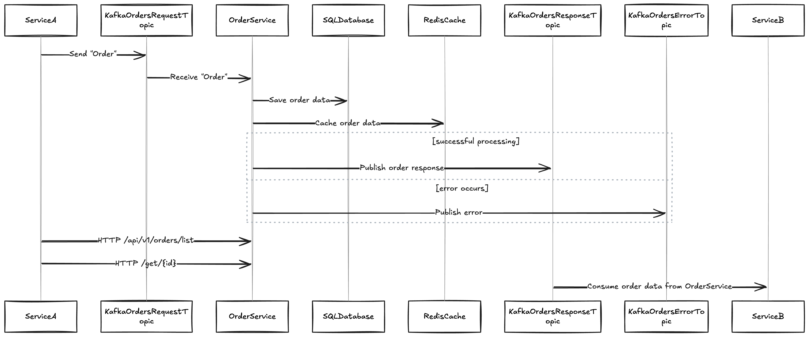

# Order Service Application

## Objetivo da Aplicação
Esta aplicação gerencia pedidos recebidos de um sistema externo (Produto Externo A), processa os dados para calcular o valor total de cada pedido e disponibiliza os pedidos processados para outro sistema externo (Produto Externo B). Ela é projetada para suportar um volume elevado de pedidos (150k-200k por dia), utilizando uma arquitetura moderna baseada em filas Kafka e cache Redis para garantir desempenho e escalabilidade.

---

## Estrutura do Projeto



- **Modelos**:
    - `Order`: Representa um pedido, contendo uma lista de produtos e o valor total do pedido.
    - `Product`: Representa um produto no pedido, com detalhes como quantidade, preço e total.

- **DTOs**:
    - `OrderRequest` e `OrderResponse`: Facilita a comunicação entre o cliente e a aplicação.
    - `ProductRequest` e `ProductResponse`: Fazem o mapeamento dos produtos.

- **Mapper**:
    - `OrderMapper` e `ProductMapper`: Convertem DTOs em entidades e vice-versa.

- **Repositórios**:
    - `OrderRepository`: Gerencia a persistência dos pedidos no banco de dados.

- **Serviços**:
    - `OrderService`: Processa os pedidos, armazena no banco e utiliza Redis para caching.

- **Kafka**:
    - **Consumer**: Lê mensagens de um tópico Kafka, processa o pedido e envia para outro tópico.
    - **Producer**: Envia mensagens processadas para o Kafka.

- **Configurações**:
    - Configurações para Kafka e Redis, garantindo integração eficiente.
    - Spring Actuator para monitoramento da saúde da aplicação.

- **Controladores**:
    - Apenas para testes, oferecendo endpoints REST para criar, listar e buscar pedidos.

---

## Arquitetura
A aplicação utiliza:
1. **Filas Kafka**:
    - Kafka é usado para comunicação assíncrona entre componentes.
    - Configuração do consumidor com `concurrency=3` para paralelismo.
    - Controle manual de offsets (`enable-auto-commit=false`) para maior confiabilidade.

2. **Cache Redis**:
    - Reduz consultas ao banco de dados utilizando Redis para armazenar pedidos recentes e listas de pedidos.
    - Estratégia TTL de 10 minutos para evitar dados desatualizados.
  
 2. **Banco SQL**:
    - No projeto apenas para fins de teste foi utilizado o Banco H2 SQL
    - Dados estão estruturados para garantir a persistência ATOMICA de um banco de SQL;

---

## Vantagens
- Arquitetura escalável com Kafka e Redis.
- Monitoramento com Spring Actuator.
- Caching eficiente para redução de latência.
- Configuração Kafka otimizada para alta carga.

---

## Passo a Passo

### Subir a Aplicação Spring Boot
1. Certifique-se de que Docker está instalado.
2. Suba os serviços usando o `docker-compose.yml`:
   ```bash
   docker-compose up -d
   ```
3. Inicie a aplicação Spring Boot:
   ```bash
   ./gradlew bootRun
   ```

### Testar Kafka
1. Abra um terminal e envie uma mensagem para o Kafka usando o produtor:
   ```bash
   docker exec -it kafka bash
   kafka-console-producer --broker-list localhost:9092 --topic orders-request-topic
   ```
2. Insira o JSON de exemplo:
   ```json
   {
       "products": [
           {"productId": 1, "quantity": 2, "price": 25.50, "name": "Product A"},
           {"productId": 2, "quantity": 1, "price": 15.75, "name": "Product B"}
       ],
        "customerId": 10
   }
   ```
3. Acompanhe os logs da aplicação para verificar o consumo e a produção de mensagens.

### Configurações Kafka
- **Consumer**:
    - Grupo: `order-consumer-group`.
    - Offset inicial: `earliest`.
- **Producer**:
    - Serializadores para chave e valor como strings.

---

## Estratégia com Redis
- Redis é usado para armazenar:
    - Pedidos individuais (`ORDER_{id}`).
    - Lista de todos os pedidos (`ALL_ORDERS`).
- TTL configurado para 10 minutos, balanceando entre consistência e performance.
- Serialização de dados usando `GenericJackson2JsonRedisSerializer`.

---

## Tecnologias Utilizadas
- **Spring Boot**: Framework principal.
- **Spring Data JPA**: Persistência de dados.
- **Spring Kafka**: Comunicação com Kafka.
- **Spring Data Redis**: Integração com Redis.
- **Spring Actuator**: Monitoramento da saúde.
- **Swagger/OpenAPI**: Documentação dos endpoints.

---

Com essa abordagem, o projeto é capaz de lidar com grandes volumes de dados, oferecendo desempenho, escalabilidade e monitoramento contínuo.
